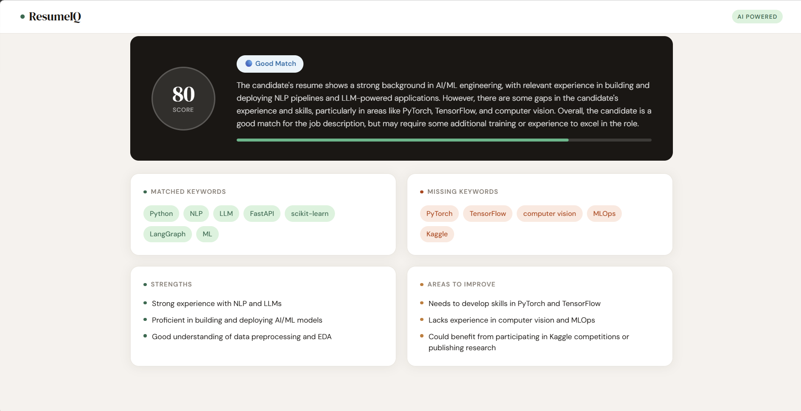

# ResumeIQ — AI-Powered Resume Screener

> An intelligent resume screening tool that compares your resume against a job description using the Groq AI API (LLaMA 3.3). Get a match score, keyword analysis, strengths, and actionable improvement suggestions — instantly.

[](https://resumeiq-55h8.onrender.com)
[](https://opensource.org/licenses/MIT)

---

## 🌐 Live Demo

👉 **[resumeiq-55h8.onrender.com](https://resumeiq-55h8.onrender.com)**

> ⚡ Hosted on Render's free tier — the server may take 15-20 seconds to wake up on first visit.

---

## 📸 Demo Preview



*Upload your resume and a job description to get an instant AI-powered match score, keyword breakdown, strengths, and improvement suggestions.*

---

## 📑 Table of Contents

- [Live Demo](#-live-demo)
- [Demo Preview](#-demo-preview)
- [Features](#-features)
- [Tech Stack](#-tech-stack)
- [Project Structure](#-project-structure)
- [Setup & Installation](#-setup--installation)
- [How to Use](#-how-to-use)
- [Deployment](#️-deployment-free-on-render)
- [Roadmap](#-roadmap)
- [What I Learned](#-what-i-learned)
- [Contributing](#-contributing)
- [License](#-license)

---

## ✨ Features

- **Match Score** — Get a 0–100 ATS compatibility score
- **Keyword Analysis** — See which keywords match and which are missing
- **Strengths** — Understand what makes your resume stand out
- **Improvements** — Get specific, actionable suggestions
- **PDF Upload** — Upload your resume as a PDF or paste text directly
- **Clean UI** — Modern, minimal interface

---

## 🛠 Tech Stack

| Layer | Tech |
|-------|------|
| Backend | Python, Flask |
| AI | Groq API (LLaMA 3.3) |
| PDF Parsing | pdfplumber |
| Frontend | HTML, CSS, Vanilla JS |

---

## 📁 Project Structure

```
resume-screener/
├── app.py                  # Flask backend & API logic
├── requirements.txt        # Python dependencies
├── .env.example             # Environment variable template
├── .gitignore
├── templates/
│   └── index.html          # Main UI
└── static/
    ├── css/
    │   └── style.css       # Styles
    └── js/
        └── main.js         # Frontend logic
```

---

## 🚀 Setup & Installation

### 1. Clone the repository
```bash
git clone https://github.com/ayush-s-tomar/ResumeIQ.git
cd ResumeIQ
```

### 2. Create a virtual environment
```bash
python -m venv venv

# On Windows:
venv\Scripts\activate

# On Mac/Linux:
source venv/bin/activate
```

### 3. Install dependencies
```bash
pip install -r requirements.txt
```

### 4. Set up your API key
Get a free API key from [console.groq.com](https://console.groq.com), then:
```bash
cp .env.example .env
```
Edit `.env` and add your key:
```
GROQ_API_KEY=your_groq_key_here
```

### 5. Run the app
```bash
python app.py
```
Open your browser at **http://localhost:5000**

---

## 📖 How to Use

1. Upload your resume as a PDF or paste the text
2. Paste the job description in the right panel
3. Click **Analyze Match**
4. Review your score, matched/missing keywords, and suggestions

---

## ☁️ Deployment (Free on Render)

1. Push this repo to GitHub
2. Go to [render.com](https://render.com) → New → Web Service
3. Connect your GitHub repo
4. Set **Build Command**: `pip install -r requirements.txt`
5. Set **Start Command**: `gunicorn app:app`
6. Add environment variable: `GROQ_API_KEY` = your key
7. Deploy!

> Add `gunicorn` to `requirements.txt` before deploying: `gunicorn==22.0.0`

---

## 🧠 What I Learned

- Building REST APIs with Flask
- Integrating LLM APIs (Groq — LLaMA 3.3)
- PDF text extraction with pdfplumber
- Frontend form handling and async fetch
- Deploying Python web apps on Render

---

## 🗺 Roadmap

- [ ] Cover letter generator
- [ ] Interview prep / mock Q&A mode
- [ ] Export analysis report as PDF
- [ ] Support for DOCX resume uploads
- [ ] Resume history / saved analyses

---

## 🤝 Contributing

Contributions, issues, and feature requests are welcome!

1. Fork the repo
2. Create a feature branch (`git checkout -b feature/your-feature`)
3. Commit your changes (`git commit -m 'Add some feature'`)
4. Push to the branch (`git push origin feature/your-feature`)
5. Open a Pull Request

---

## 📄 License

This project is licensed under the [MIT License](./LICENSE) — feel free to use and modify.

---

## 👤 Author

Built by **[Ayush Singh Tomar](https://github.com/ayush-s-tomar)**

If you found this project useful, consider giving it a ⭐ on GitHub!